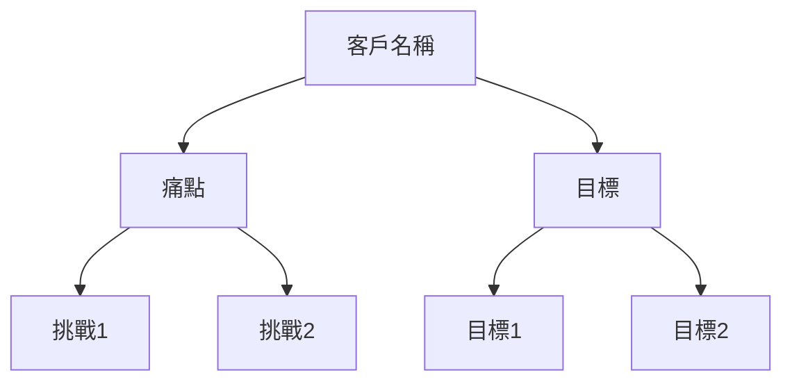

# 會議分析服務 (Meeting Analysis Service)

**模組名稱**: Meeting Analysis Service
**主要功能**: OpenAI 驅動的會議內容分析與 AI 內容生成
**最後更新**: 2025-11-18

---

## 📋 功能描述

會議分析服務是 CoachRocks AI 的核心功能，負責使用 OpenAI GPT-4o-mini 模型分析教練會議內容，自動提取客戶資訊、識別痛點與目標、生成後續行動建議和社交媒體內容。

### 主要用途場景

1. **自動會議分析** - 處理會議記錄，提取結構化資訊
2. **客戶洞察生成** - 識別客戶痛點、目標和背景資訊
3. **內容自動生成** - 產生後續郵件、心智圖、Reels 腳本
4. **會議類型偵測** - 區分探索會議 (Discovery) 與諮詢會議 (Consulting)
5. **多輪內容生成** - 為後續會議提供準備建議

---

## 📂 檔案位置

### 核心服務檔案

- **`backend/src/services/openai.ts`** - OpenAI 服務類別，封裝所有 AI 呼叫
- **`backend/src/services/perplexity.ts`** - Perplexity API 服務 (資源清單生成)

### API 端點檔案

- **`backend/src/endpoints/analyzeAuthenticatedMeeting.ts`** - 認證使用者會議分析端點
- **`backend/src/endpoints/startAnalysisWithEmail.ts`** - 郵件驗證會議分析端點
- **`backend/src/endpoints/summarizeText.ts`** - 文字摘要端點
- **`backend/src/endpoints/generateMindMap.ts`** - 心智圖生成端點
- **`backend/src/endpoints/generateFollowUpEmail.ts`** - 後續郵件生成端點
- **`backend/src/endpoints/generateReelsScripts.ts`** - Reels 腳本生成端點
- **`backend/src/endpoints/generateNextMeetingPrep.ts`** - 下次會議準備生成端點
- **`backend/src/endpoints/generateResourcesList.ts`** - 資源清單生成端點 (DeepSeek)
- **`backend/src/endpoints/generatePerplexityResourcesList.ts`** - 資源清單生成端點 (Perplexity)

### 輔助檔案

- **`backend/src/utils/responseParser.ts`** - AI 回應解析工具
- **`backend/src/utils/analysisValidation.ts`** - 分析結果驗證工具

---

## 🔧 主要函數

### OpenAIService 類別 (`openai.ts`)

#### 1. `detectMeetingType(transcript: string)`

**用途**: 偵測會議類型 (探索會議或諮詢會議)

**參數**:
- `transcript` (string) - 會議記錄文字

**回傳值**:
```typescript
Promise<{ isDiscovery: boolean }>
```

**呼叫位置**:
- `analyzeAuthenticatedMeeting.ts:238`
- `startAnalysisWithEmail.ts:235`

**設計邏輯**:
- 使用 OpenAI 分析會議內容特徵
- 判斷是否為初次探索會議 (關注問題、目標)
- 或為後續諮詢會議 (提供建議、行動計畫)

---

#### 2. `summarizeText(text: string, type: 'discovery' | 'consulting')`

**用途**: 根據會議類型產生結構化摘要

**參數**:
- `text` (string) - 會議記錄完整內容
- `type` ('discovery' | 'consulting') - 會議類型

**回傳值**:
```typescript
Promise<string> // JSON 格式的結構化摘要
```

**結構化輸出格式**:
```json
{
  "clientInfo": {
    "name": "客戶名稱",
    "company": "公司名稱",
    "industry": "產業",
    "profession": "職業"
  },
  "painPoints": ["痛點1", "痛點2"],
  "goals": ["目標1", "目標2"],
  "currentChallenges": ["挑戰1", "挑戰2"],
  "coachSuggestions": ["建議1", "建議2"],
  "actionItems": ["行動1", "行動2"],
  "insights": "教練洞察"
}
```

**呼叫位置**:
- `analyzeAuthenticatedMeeting.ts:252-256`
- `startAnalysisWithEmail.ts:249-253`

**設計邏輯**:
- 根據會議類型使用不同的系統提示詞
- Discovery 會議: 聚焦於問題探索、背景了解
- Consulting 會議: 聚焦於解決方案、行動計畫
- 使用 GPT-4o-mini 模型，max_tokens: 4000

**Timeout 保護** (2025-11-16 新增):
- 25 秒超時限制，防止 Cloudflare Workers 30s 硬性限制
- 失敗時拋出明確錯誤訊息

---

#### 3. `generateMindMap(summary: string, type: 'sales' | 'consulting')`

**用途**: 根據會議摘要產生 Mermaid 格式心智圖

**參數**:
- `summary` (string) - 會議摘要 JSON 字串
- `type` ('sales' | 'consulting') - 業務類型

**回傳值**:
```typescript
Promise<string> // Mermaid flowchart 語法
```

**產生範例**:


**呼叫位置**:
- `analyzeAuthenticatedMeeting.ts:291-295`
- `startAnalysisWithEmail.ts:288-292`
- `generateMindMap.ts`

**Timeout 保護**: 25 秒超時限制

---

#### 4. `generateFollowUpEmail(summary: any, isDiscovery: boolean)`

**用途**: 產生後續追蹤郵件 (主旨 + 內容)

**參數**:
- `summary` (any) - 會議摘要物件
- `isDiscovery` (boolean) - 是否為探索會議

**回傳值**:
```typescript
Promise<{
  subject: string;  // 郵件主旨
  body: string;     // 郵件內容 (HTML 格式)
}>
```

**郵件內容特點**:
- Discovery 會議: 感謝探索、重述痛點、提出下一步
- Consulting 會議: 總結建議、行動項目、追蹤計畫
- HTML 格式，專業教練語氣

**呼叫位置**:
- `analyzeAuthenticatedMeeting.ts:305-309`
- `startAnalysisWithEmail.ts:302-306`
- `generateFollowUpEmail.ts`

**Timeout 保護**: 25 秒超時限制

---

#### 5. `generateReelsScripts(summary: string)`

**用途**: 產生 Instagram Reels 腳本 (短影音內容)

**參數**:
- `summary` (string) - 會議摘要 JSON 字串

**回傳值**:
```typescript
Promise<string> // JSON 陣列格式的腳本列表
```

**腳本格式**:
```json
[
  {
    "title": "Reel 標題",
    "hook": "吸睛開場 (前 3 秒)",
    "body": "主要內容",
    "cta": "行動呼籲"
  }
]
```

**內容特點**:
- 每個腳本 30-60 秒
- 基於會議洞察創建教練內容
- 適合 Instagram Reels / TikTok

**呼叫位置**:
- `analyzeAuthenticatedMeeting.ts:333-337`
- `startAnalysisWithEmail.ts:330-334`
- `generateReelsScripts.ts`

**Timeout 保護**: 25 秒超時限制

---

#### 6. `generateNextMeetingPrep(meetingsData: any[])`

**用途**: 根據歷史會議資料產生下次會議準備建議

**參數**:
- `meetingsData` (any[]) - 客戶歷史會議陣列

**回傳值**:
```typescript
Promise<{
  keyTopics: string[];           // 關鍵主題
  progressReview: string[];      // 進度回顧
  suggestedQuestions: string[];  // 建議問題
  focusAreas: string[];          // 聚焦領域
}>
```

**呼叫位置**:
- `generateNextMeetingPrep.ts`

**設計邏輯**:
- 分析客戶所有歷史會議
- 識別重複出現的主題和挑戰
- 產生針對性的準備建議

**Timeout 保護**: 25 秒超時限制

---

## 🔗 相關函數

### 私有輔助函數

#### `callOpenAI(systemPrompt: string, userPrompt: string, maxTokens: number)`

**用途**: 封裝 OpenAI API 呼叫

**參數**:
- `systemPrompt` (string) - 系統角色提示詞
- `userPrompt` (string) - 使用者輸入內容
- `maxTokens` (number) - 最大回應 Token 數，預設 3000

**呼叫位置**:
- 所有公開分析函數的底層呼叫

**錯誤處理**:
- 參數驗證 (非空字串)
- API 呼叫失敗處理
- 詳細錯誤日誌記錄

**模型設定**:
```typescript
{
  model: "gpt-4o-mini",
  temperature: 0.7,
  max_completion_tokens: maxTokens
}
```

---

#### `callCloudflareAI(env: Env, systemPrompt: string, userPrompt: string, maxTokens: number)`

**用途**: 使用 Cloudflare Workers AI (Llama 模型) 作為備用

**設計邏輯**:
- 主要模型: `@cf/meta/llama-3.1-8b-instruct`
- 備用模型: `@cf/meta/llama-2-7b-chat-int8`
- 清理提示詞中的控制字元

**注意事項**:
- 目前未在主要流程中使用
- 作為 OpenAI 失敗時的備用方案

---

## 📊 函數與變數列表

### 公開函數 (Public Methods)

| 函數名稱 | 參數 | 回傳值 | 用途 |
|---------|------|--------|------|
| `detectMeetingType` | transcript: string | Promise<{isDiscovery: boolean}> | 偵測會議類型 |
| `summarizeText` | text: string, type: string | Promise<string> | 產生結構化摘要 |
| `generateMindMap` | summary: string, type: string | Promise<string> | 產生心智圖 |
| `generateFollowUpEmail` | summary: any, isDiscovery: boolean | Promise<{subject, body}> | 產生後續郵件 |
| `generateReelsScripts` | summary: string | Promise<string> | 產生 Reels 腳本 |
| `generateNextMeetingPrep` | meetingsData: any[] | Promise<object> | 產生下次會議準備 |
| `testAIBinding` | env: Env | Promise<string> | 測試 AI 綁定 |

### 私有函數 (Private Methods)

| 函數名稱 | 參數 | 回傳值 | 用途 |
|---------|------|--------|------|
| `callOpenAI` | systemPrompt, userPrompt, maxTokens | Promise<string> | OpenAI API 呼叫封裝 |
| `callCloudflareAI` | env, systemPrompt, userPrompt, maxTokens | Promise<string> | Cloudflare AI 備用呼叫 |

### 類別變數 (Class Properties)

| 變數名稱 | 類型 | 用途 |
|---------|------|------|
| `client` | OpenAI | OpenAI SDK 客戶端實例 |
| `env` | Env | 環境變數綁定 (API Keys) |

---

## 🏗️ 設計概念

### 架構設計

```
┌─────────────────────────────────────────┐
│   API Endpoints (analyzeAuthenticatedMeeting.ts) │
└─────────────────┬───────────────────────┘
                  │
                  ▼
┌─────────────────────────────────────────┐
│   OpenAIService (openai.ts)            │
│   ┌─────────────────────────────────┐  │
│   │  detectMeetingType()           │  │
│   │  summarizeText()               │  │
│   │  generateMindMap()             │  │
│   │  generateFollowUpEmail()       │  │
│   │  generateReelsScripts()        │  │
│   │  generateNextMeetingPrep()     │  │
│   └─────────────────────────────────┘  │
│                 │                       │
│                 ▼                       │
│   ┌─────────────────────────────────┐  │
│   │  callOpenAI() - 私有函數       │  │
│   └─────────────────────────────────┘  │
└─────────────────┬───────────────────────┘
                  │
                  ▼
┌─────────────────────────────────────────┐
│   OpenAI API (gpt-4o-mini)             │
└─────────────────────────────────────────┘
```

### 設計模式

1. **服務類別模式 (Service Class Pattern)**
   - 單一職責: OpenAIService 專注於 AI 呼叫
   - 封裝性: 私有函數隔離實作細節

2. **依賴注入 (Dependency Injection)**
   - 透過建構子注入 `Env` 環境變數
   - 方便測試和配置管理

3. **錯誤傳播 (Error Propagation)**
   - 底層錯誤向上拋出，由端點統一處理
   - 保留完整錯誤堆疊資訊

4. **超時保護模式 (Timeout Protection Pattern)** - 2025-11-16 新增
   - 所有 AI 呼叫設定 25 秒超時
   - 避免 Cloudflare Workers 30 秒硬性限制
   - 快速失敗而非無限等待

---

## 📍 函數變數使用位置

### `detectMeetingType()` 呼叫位置

```typescript
// analyzeAuthenticatedMeeting.ts:238
const detectionResult = await openaiService.detectMeetingType(fileContent)
const isDiscoveryMeeting = detectionResult.isDiscovery

// startAnalysisWithEmail.ts:235
const detectionResult = await openaiService.detectMeetingType(fileContent)
const isDiscoveryMeeting = detectionResult.isDiscovery
```

### `summarizeText()` 呼叫位置

```typescript
// analyzeAuthenticatedMeeting.ts:252-256
const summaryJson = await openaiService.summarizeText(
  fileContent,
  isDiscoveryMeeting ? 'discovery' : 'consulting'
)
const summary = JSON.parse(summaryJson)

// startAnalysisWithEmail.ts:249-253
const summaryJson = await openaiService.summarizeText(
  fileContent,
  isDiscoveryMeeting ? 'discovery' : 'consulting'
)
const summary = JSON.parse(summaryJson)
```

### `generateMindMap()` 呼叫位置

```typescript
// analyzeAuthenticatedMeeting.ts:291-295
const mindMapMermaid = await openaiService.generateMindMap(
  summaryJson,
  isDiscoveryMeeting ? 'sales' : 'consulting'
)

// generateMindMap.ts:85-89
const mindMapMermaid = await openaiService.generateMindMap(
  summaryData.summary,
  summaryData.meeting_type === 'discovery' ? 'sales' : 'consulting'
)
```

### `generateFollowUpEmail()` 呼叫位置

```typescript
// analyzeAuthenticatedMeeting.ts:305-309
const emailResult = await openaiService.generateFollowUpEmail(
  summary,
  isDiscoveryMeeting
)

// generateFollowUpEmail.ts:96-100
const emailResult = await openaiService.generateFollowUpEmail(
  summaryData.summary,
  summaryData.meeting_type === 'discovery'
)
```

### `generateReelsScripts()` 呼叫位置

```typescript
// analyzeAuthenticatedMeeting.ts:333-337
const reelsScripts = await openaiService.generateReelsScripts(summaryJson)

// generateReelsScripts.ts:96-98
const reelsScripts = await openaiService.generateReelsScripts(
  JSON.stringify(summaryData.summary)
)
```

---

## ❓ QA 常見問題

### Q1: 為什麼使用 gpt-4o-mini 而不是 gpt-4？

**A**:
- **成本效益**: gpt-4o-mini 成本約為 gpt-4 的 1/10
- **速度**: 回應速度快 2-3 倍，改善使用者體驗
- **準確度**: 對於結構化任務 (摘要、分析)，準確度已足夠
- **Token 限制**: 支援足夠的上下文長度 (128k tokens)

### Q2: 如何處理超長會議記錄？

**A**:
- **前端預處理**: 限制上傳檔案大小 (建議 < 50MB)
- **文字擷取**: MP4 影片轉錄後通常不超過 20k tokens
- **分段處理**: 未來可實作分段摘要 + 合併策略

### Q3: AI 分析失敗時如何處理？

**A**:
```typescript
// analyzeAuthenticatedMeeting.ts:373-385
try {
  // 背景分析流程
} catch (error) {
  // 1. 更新會議狀態為 'failed'
  await c.env.DB.prepare(`
    UPDATE meetings SET status = 'failed', error_message = ?
    WHERE meeting_id = ?
  `).bind(errorMessage, meetingId).run()

  // 2. 發送失敗通知郵件
  await sendAnalysisCompleteEmail(
    c.env, userEmail, token, fileName,
    finalClientName, 'failed', errorMessage
  )
}
```

### Q4: 如何確保 AI 回應格式正確？

**A**:
- **明確的系統提示詞**: 要求回傳 JSON 格式
- **範例輸出**: 在提示詞中提供輸出範例
- **解析驗證**: 使用 `JSON.parse()` 驗證格式
- **錯誤處理**: 解析失敗時記錄錯誤並重試

### Q5: Cloudflare Workers 30s 限制如何處理？

**A** (2025-11-16 更新):
- **背景執行**: 使用 `context.waitUntil()` 在背景執行分析
- **超時保護**: 每個 AI 步驟設定 25s 超時 (低於 30s 限制)
- **快速失敗**: 超時時立即拋出錯誤，不會無限等待
- **狀態追蹤**: 更新資料庫狀態為 'failed'，使用者可查詢

```typescript
// 每個 AI 呼叫都包含超時保護
const timeoutPromise = new Promise((_, reject) =>
  setTimeout(() => reject(new Error('Operation timeout')), 25000)
)
const result = await Promise.race([
  openaiService.summarizeText(content, type),
  timeoutPromise
])
```

---

## 🐛 Debug 說明

### 啟用詳細日誌

會議分析服務已內建詳細的 console.log，可透過 Wrangler 查看：

```bash
# 開發環境即時日誌
npm run dev

# 生產環境尾隨日誌
wrangler tail

# 過濾特定關鍵字
wrangler tail --format pretty | grep "OpenAI"
```

### 關鍵日誌點

```typescript
// 1. API Key 驗證
console.log('OpenAI API Key available:', !!env.OPENAI_API_KEY)

// 2. API 呼叫開始
console.log('Calling OpenAI API...')
console.log('System prompt length:', systemPrompt.length)
console.log('User prompt length:', userPrompt.length)

// 3. 會議類型偵測
console.log('Detected meeting type:', isDiscovery ? 'Discovery' : 'Consulting')

// 4. 分析步驟完成
console.log('✅ Summary generated')
console.log('✅ Mind map generated')
console.log('✅ Follow-up email generated')
console.log('✅ Reels scripts generated')
```

### 測試 OpenAI 連線

```bash
# 使用測試端點
curl -X POST https://coach-backend.gamepig1976.workers.dev/api/test-ai \
  -H "Content-Type: application/json"

# 預期回應
{
  "success": true,
  "message": "AI integration test successful",
  "testResult": "Hello from OpenAI GPT-4o-mini!"
}
```

### 常見錯誤排查

#### 錯誤 1: `OPENAI_API_KEY is not set`

**原因**: 環境變數未設定

**解決方案**:
```bash
# 開發環境 (.dev.vars)
echo "OPENAI_API_KEY=sk-..." >> backend/.dev.vars

# 生產環境
wrangler secret put OPENAI_API_KEY
```

#### 錯誤 2: `OpenAI API call failed: timeout`

**原因**: API 呼叫超時 (> 25 秒)

**解決方案**:
- 檢查網路連線
- 確認 OpenAI API 狀態: https://status.openai.com/
- 會議內容過長時，考慮分段處理

#### 錯誤 3: `Unexpected token in JSON`

**原因**: AI 回應格式不正確

**解決方案**:
```typescript
// 檢查原始回應
console.log('Raw AI response:', summaryJson)

// 使用 try-catch 保護解析
try {
  const summary = JSON.parse(summaryJson)
} catch (error) {
  console.error('JSON parse failed:', error)
  console.error('Raw response:', summaryJson)
  throw new Error('Invalid JSON response from AI')
}
```

#### 錯誤 4: `Analysis stuck at 'processing'`

**原因**: 背景分析超時或失敗但未更新狀態

**解決方案**:
```sql
-- 檢查會議狀態
SELECT meeting_id, status, error_message, created_at
FROM meetings
WHERE status = 'processing'
AND created_at < datetime('now', '-5 minutes');

-- 手動更新失敗狀態
UPDATE meetings
SET status = 'failed',
    error_message = 'Analysis timeout - manual intervention'
WHERE meeting_id = 'xxx';
```

---

## 🔒 安全考量

### API Key 保護

- ✅ 使用 Wrangler Secrets 儲存 API Key
- ✅ 不在日誌中記錄完整 API Key
- ✅ 前端不可直接呼叫 OpenAI API

### 輸入驗證

```typescript
// 參數驗證
if (!systemPrompt || typeof systemPrompt !== 'string') {
  throw new Error('System prompt is required and must be a string')
}
if (!userPrompt || typeof userPrompt !== 'string') {
  throw new Error('User prompt is required and must be a string')
}
```

### 費率限制

- OpenAI API 有費率限制 (RPM, TPM)
- 建議實作前端/後端雙重節流
- 監控 API 使用量，設定預算警報

---

## 📚 相關文件

- [04_database_service.md](./04_database_service.md) - 資料庫服務
- [08_notification_emails.md](./08_notification_emails.md) - 通知郵件系統
- [10_cloudflare_deployment.md](./10_cloudflare_deployment.md) - Cloudflare 部署
- [OpenAI API 文件](https://platform.openai.com/docs/api-reference) - 官方文件

---

**文件版本**: 1.0
**維護者**: Development Team
**更新記錄**:
- 2025-11-18: 初始版本建立
- 2025-11-16: 新增 25s 超時保護機制
